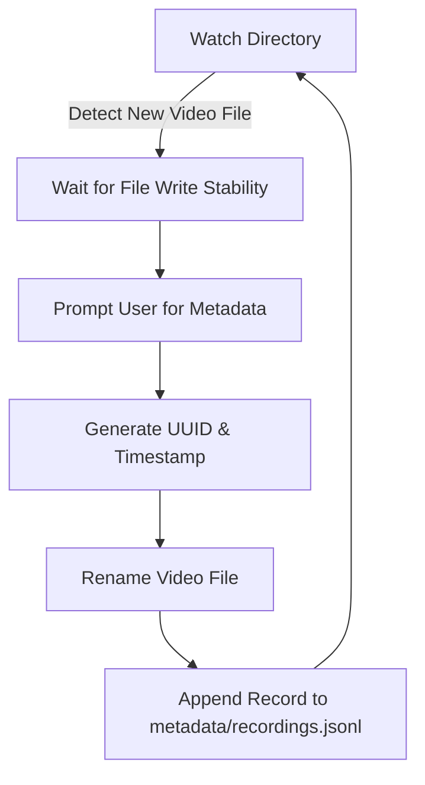

# NL-ASL Capture Labeler

Automated watcher and interactive metadata capture CLI tool for American Sign Language (ASL) video recordings.

## Rationale & Goal
When recording ASL dataset samples, quick labeling and metadata structuring are critical for building downstream machine learning and gesture recognition pipelines. This tool watches a target directory for incoming video recordings (`.mp4`, `.mov`, `.mkv`, `.webm`), prompts the user for capture metadata (English prompt, capture type, take number, quality, and preferred status), automatically renames the files with a unique timestamp and UUID, and appends structured metadata records to a JSONL file.

## Main Features
- **Directory Watching**: Monitors designated directory for newly added video files.
- **File Stability Check**: Waits until file write operations are completed before processing.
- **Interactive Metadata Prompting**: Collects prompt, capture type (sentence/word/letter), take number, self-assessed quality, and preferred take flag.
- **Standardized Renaming**: Renames files using `<timestamp>_<recording_id>.<ext>`.
- **JSONL Metadata Logging**: Appends metadata records formatted as JSON Lines for easy dataset parsing.

## Application Data Flow



## Quickstart

### Prerequisites
- Python >= 3.13
- [`uv`](https://github.com/astral-sh/uv) package manager

### Running the Application

```bash
uv run python asl_capture_labeler.py
```

## Roadmap
- [ ] Add CLI arguments for custom watch and metadata directories
- [ ] Integrate `.env` configuration file loading
- [ ] Implement desktop notifications when a new video file is detected
